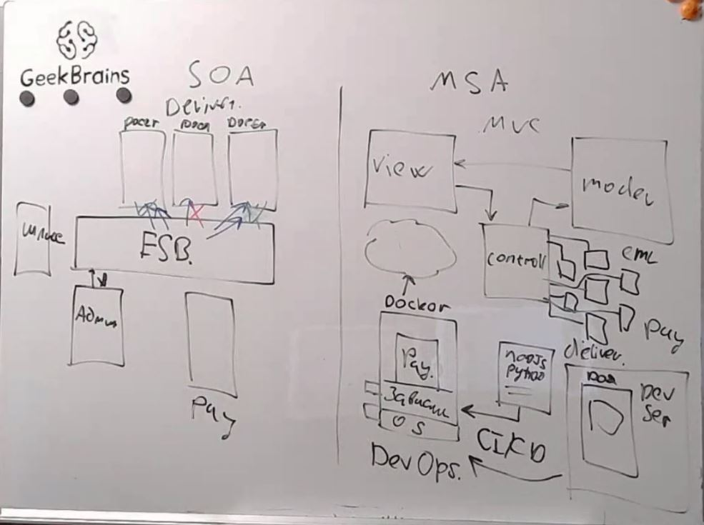
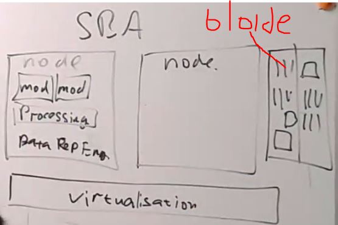
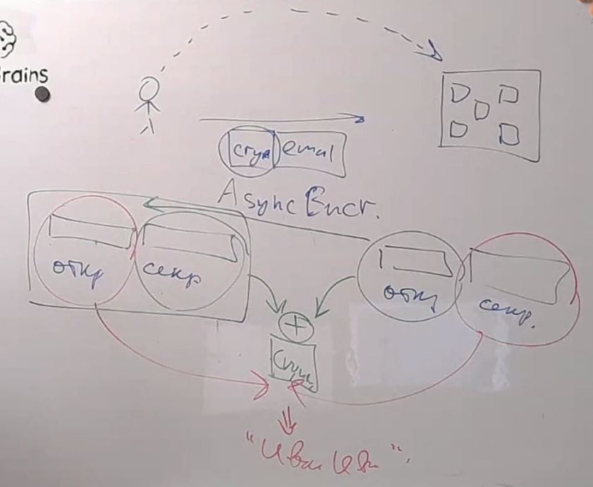
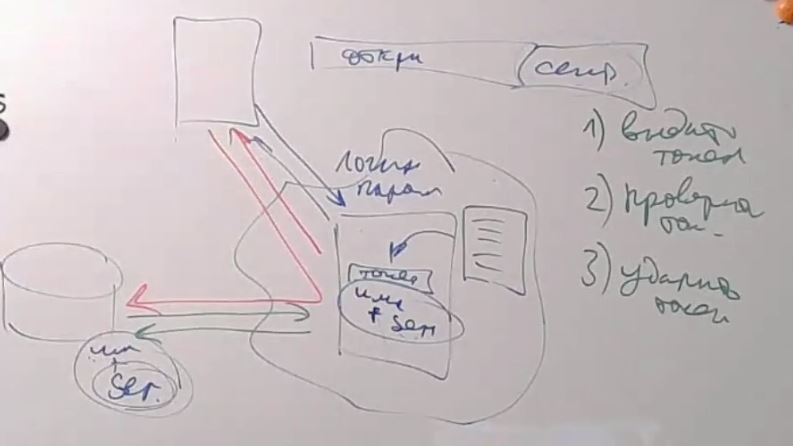
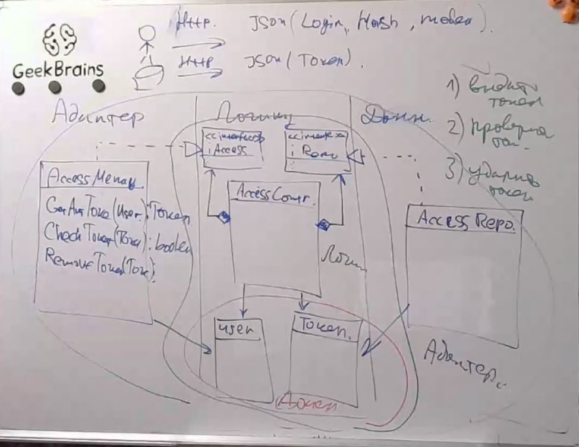
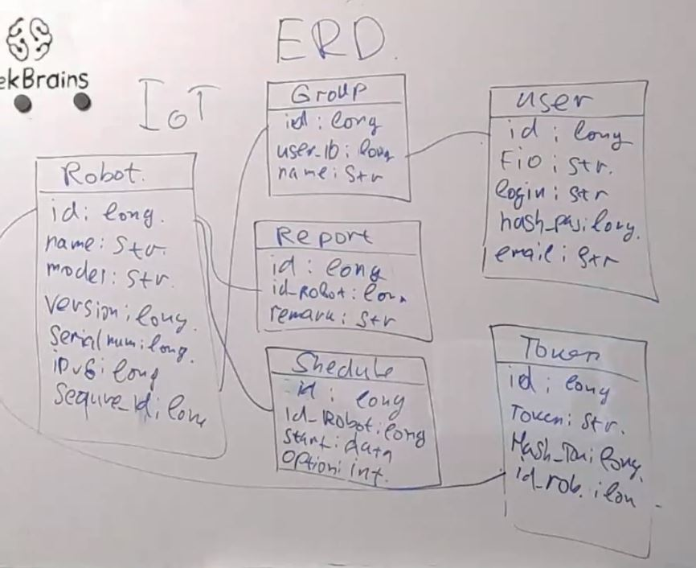

# Архитектура ПО (семинары)
## Урок 11. Сервис-ориентированные архитектуры

### SBA (с использованием node)

### Технология электронной подписи

### Технология аутентификации и пользователя(токен) 

### Прототип UML-диаграммы микро сервиса аутентификации на основе токенов безопасности

### Прототип ERD-диаграммы приложения 

## Homework
    Разработать ERD диаграмму данных хранимых в облаке:

    
    Сделать UML диаграмму:

